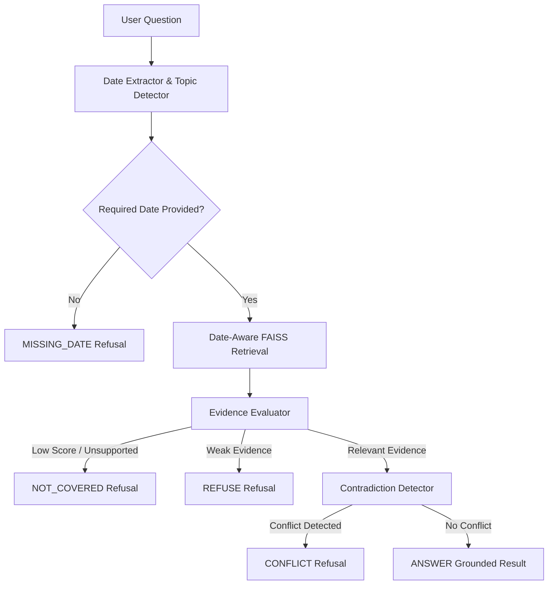

# Architectural Decisions & Technical Rationale

**Grounded Answer — Calder County Household Support Program**
**Brite Spark 2026 — Problem 1**

This document records the technical decisions, threshold choices, refusal boundaries, contradiction mechanics, and Day 2 date-aware architectural choices implemented in the Grounded Answer system.

---

## 1. Answer-vs-Refuse Boundary Design

### Core Philosophy
In caseworker policy assistance, an incorrect policy guess is far worse than an explicit refusal. The Grounded Answer system enforces a strict **"Never Hallucinate / Grounded-Only"** contract:
* **No LLM Synthesized Text**: Answers are constructed directly from authoritative policy provisions without generative paraphrasing or text rewriting.
* **Separation of Retrieval & Sufficiency**: Retrieving semantically similar text does not imply that the manual answers the user's claim. A dedicated evidence evaluation layer (`EvidenceEvaluator`) validates textual support before answer generation is permitted.

### Decision Taxonomy

The pipeline classifies every user query into one of five deterministic outcomes:

1. **`ANSWER`**:
   * *Condition*: Dense retrieval score $\ge 0.50$, direct concept support confirmed, and no policy contradiction detected.
   * *Output*: Verbatim policy provision text with exact clause citation (§X.Y.Z) and source metadata.

2. **`NOT_COVERED`**:
   * *Condition*: Dense retrieval score $< 0.45$ OR retrieved passages fail direct conceptual support validation (e.g. asking for housing loans or legal representation).
   * *Output*: Explicit refusal explaining policy manual boundary, plus escalation advice directing the user to Household Support Services team.

3. **`MISSING_DATE`**:
   * *Condition*: Policy topic is date-sensitive (e.g., reporting change of circumstances, income thresholds) but query omits the claim or determination date.
   * *Output*: Safety refusal refusing to guess today's policy date, prompting the user for the claim date.

4. **`CONFLICT`**:
   * *Condition*: Multiple retrieved provisions state contradictory numerical requirements for the same policy concept (e.g., pre-amendment §4.3.2 10 days vs §9.1.4 30 days).
   * *Output*: Refusal identifying the contradiction, presenting both conflicting clauses, and escalating to a Department Supervisor under §1.1.3.

5. **`REFUSE`**:
   * *Condition*: Retrieved evidence score is between 0.45 and 0.50 without strong conceptual alignment.
   * *Output*: Refusal citing insufficient evidence and advising consultation with a senior policy officer.

---

## 2. Evidence Thresholds & Rationale

| Threshold Parameter | Value | Technical Rationale |
|---|---|---|
| `minimum_score` | `0.45` | Empirical cosine similarity floor using `all-MiniLM-L6-v2`. Scores below 0.45 represent background noise or unrelated sections. |
| `strong_score` | `0.50` | Score threshold above which semantic alignment indicates high relevance for answer candidates. |
| `minimum_keyword_overlap` | `0.12` | Lexical overlap threshold (excluding stop words) ensuring retrieved text matches query vocabulary. |
| `minimum_concept_overlap` | `1.0` | Mandatory domain concept match ensuring retrieved text discusses the specific claim (e.g., `loan`, `childcare`, `reporting`). |

### Why Dense Embeddings Alone Are Insufficient
Vector similarity alone can create false positives when a question uses program terminology. For example, asking *"Can I apply for a personal loan?"* matches general recipient eligibility clauses because words like *"apply"* and *"assistance"* produce high cosine similarity. 

To solve this **Apparent Gap** problem, `EvidenceEvaluator` performs secondary validation:
* Specific query concepts (`loan`, `childcare`, `legal_representation`) must explicitly exist in the retrieved provision text. If missing, the engine downgrades the result to `NOT_COVERED` despite vector similarity.

---

## 3. Contradiction Detection & Escalation

### The Pre-Amendment Reporting Inconsistency
The consolidated policy manual (as at 31 December 2025) contains a genuine internal contradiction:
* **§4.3.2**: Recipient must report changes of circumstances within **10 calendar days**.
* **§9.1.4**: States that overpayments do not arise if reported within **30 calendar days required under §4.3**.

### Detection Logic (`ContradictionDetector`)
Instead of hardcoding specific test cases, `ContradictionDetector` analyzes all top-ranked candidate provisions for structural conflicts:
1. **RegEx Extraction**: Extracts time period patterns (`\d+ calendar days`) and monetary amounts (`\$\d+`).
2. **Concept Alignment**: Verifies whether both provisions govern the same policy requirement (`reporting_change`, `income_threshold`, `earnings_disregard`, `sanction`).
3. **Difference Trigger**: If two provisions describe the same concept but specify different numeric values, `ContradictionDetector` flags a `conflict`.

### Handling Policy Inconsistency
When a conflict is detected:
* The system **never picks a winner** or makes an arbitrary choice.
* Status is set to `CONFLICT`.
* Both clauses (§4.3.2 and §9.1.4) are displayed verbatim to the user.
* Escalation advice is appended instructing the caseworker to refer the case to a Department Supervisor under §1.1.3 (discretionary authority).

---

## 4. Day 2 Date-Aware Architecture

Day 2 requirements introduced date sensitivity: policy determinations must reflect the **date of the claim**, not current policy.

### Components

1. **`PolicyDateExtractor`**:
   * Uses contextual RegEx patterns to extract dates from natural language questions.
   * Differentiates `change_date` (*"income changed on 10 Feb 2026"*) from `determination_date` (*"determination made on 5 March 2026"*).

2. **`DateRequirementEvaluator`**:
   * Evaluates whether a question requires a date before retrieval proceeds.
   * Reporting queries require `change_date`. Threshold, disregard, and sanction queries require `determination_date`.
   * *Exception*: Questions explicitly citing a section (e.g. *"What does §6.4.1 say?"*) bypass date requirements as the section is explicitly requested.

3. **`PolicyVersionResolver`**:
   * Implements effective date comparison against `AMENDMENT_EFFECTIVE_DATE = date(2026, 3, 1)`.
   * Routes queries to `original` (pre-amendment) or `amended` policy versions based on claim/determination date.

4. **`EffectivePolicyResolver`**:
   * Maintains original policy provisions and overlays parsed amendments from `Amendment No. 2026-01.md`.
   * Operates as a dynamic text overlay, preserving historical text for pre-March 2026 claims and applying amended text for post-March 2026 claims.

5. **`DateAwareRetriever`**:
   * Integrates FAISS semantic retrieval with version resolution.
   * **Competing Version Preservation**: When retrieving for date-sensitive queries, `DateAwareRetriever` preserves alternative historical versions of highly ranked provisions so `ContradictionDetector` can evaluate whether historical conflicts exist.

---

## 5. Amendment No. 2026-01 Effective Date Logic

Amendment No. 2026-01 was issued on 12 February 2026 with an effective date of **1 March 2026**.

### Transitional Rule Implementation (Paragraph 5)

* **Paragraph 5.1 (Determinations on/after 1 March 2026)**:
  * Earnings disregard (§6.4.1(a) $\to$ $175/month), income thresholds (§6.6.1 table), and sanction reduction (§10.5.2 $\to$ 15%) apply to any determination made on or after 1 March 2026.
* **Paragraph 5.2 (Change of Circumstances Date)**:
  * Reporting period amendments (§4.3.2 $\to$ 14 calendar days, §9.1.4 $\to$ 14 calendar days) apply **only in respect of changes occurring on or after 1 March 2026**.
  * Changes occurring before 1 March 2026 remain governed by pre-amendment policy (retaining the §4.3.2 / §9.1.4 conflict).
* **Paragraph 5.3 (Spanning Claims)**:
  * Apportionment rules under §7.4.3 preserved.

---

## 6. Modular Architecture & Maintainability

The system maintains strict modular separation across components:

* `src/ingestion/parser.py`: Policy manual text parsing into structured provisions.
* `src/policy/amendment_parser.py`: Amendment document parsing (substitutions, tables, insertions).
* `src/policy/date_extractor.py`: RegEx date extraction.
* `src/policy/date_requirement.py`: Date requirement safety gate.
* `src/policy/versioning.py`: Policy version decision routing.
* `src/policy/effective_policy.py`: Provision text overlay resolver.
* `src/retrieval/retriever.py`: FAISS dense vector search & ranking boosts.
* `src/retrieval/date_aware_retriever.py`: Date-aware candidate retrieval & competing version recovery.
* `src/evidence/evaluator.py`: Multi-stage evidence relevance & concept verification.
* `src/evidence/contradiction.py`: Numeric & concept contradiction detector.
* `src/answer/generator.py`: Grounded answer formatter & citation builder.
* `src/pipeline/date_aware_pipeline.py`: Unified pipeline orchestrator and CLI interface.

This architecture ensures future amendments or policy changes can be added by updating markdown corpus files or version routing rules without refactoring core retrieval or answer generation logic.
